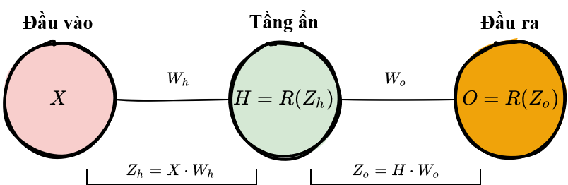
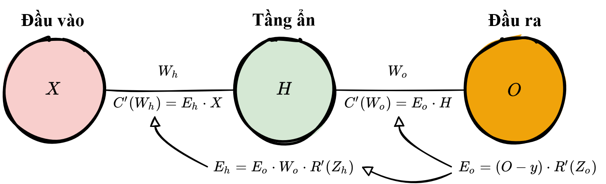

.. _backpropagation:

====================================
Lan truyền ngược - *Backpropagation*
====================================

.. contents:: :local:

Mục đích của quá trình lan truyền ngược khá hiển nhiên: điều chỉnh hay cập nhật trọng số của mạng tuỳ vào ảnh hưởng của nó tới tổng lỗi dự đoán của mạng.
Nếu ta có thể liên tục làm giảm lỗi dự đoán của từng trọng số, cuồi cùng ta sẽ thu được một tập trọng số mà có thể đưa ra dự đoán đủ tốt.

Nhắc lại về Quy tắc chuỗi - *Chain rule*
========================================

Như đã đề cập trong :doc:`forwardpropagation_vn`, quá trình lan truyền xuôi có thể được coi là một chuỗi các hàm số lồng nhau.
Theo cách hiểu này, lan truyền ngược (*backpropagation*) gần như là một phương pháp ứng dụng :ref:`chain_rule` để tìm :ref:`derivative` của hàm chi phí theo bất cứ biến số (hay các trọng số) nào trong các hàm số lồng nhau đó.
Cho hàm lan truyền xuôi có dạng:

.. math::

    f(x) = A(B(C(x)))

A, B, và C là các hàm kích hoạt tại các tầng khác nhau trong mạng. Sử dụng quy tắc chuỗi, ta có thể dễ dàng tính được đạo hàm của :math:`f(x)` theo :math:`x`:

.. math::

    f'(x) = f'(A) \cdot A'(B) \cdot B'(C) \cdot C'(x)

Vậy còn đạo hàm theo hàm :math:`B` thì sao?
Để tính đạo hàm này, ta có thể coi :math:`B(C(x))` là hằng số, thay bằng biến tạm thời :math:`B`, và tính đạo hàm của :math:`f(x)` theo biến :math:`B`.

.. math::

    f'(B) = f'(A) \cdot A'(B)

Phương pháp đơn giản này giúp mở rộng quy tắc chuỗi để ta có thể tính được đạo hàm theo bất cứ biến nào trong hàm hợp, cho phép ta xác định chính xác ảnh hưởng của từng biến lên đầu ra dự đoán của mạng.

Áp dụng quy tắc chuỗi
=====================

Hãy cùng sử dụng quy tắc chuỗi để tính đạo hàm của hàm chi phí theo bất kỳ trọng số nào trong mạng.
Quy tắc chuỗi giúp ta xác định ảnh hưởng của từng trọng số lên lỗi dự đoán và hướng cập nhật cho từng trọng số để giảm lỗi.
Các phương trình sau là các phương trình được sử dụng trong quá trình dự đoán và xác định lỗi dự đoán của mạng.

+-----------------------+-----------------------------------------+---------------------------------------------------------------------------------------+
| Hàm số                | Công thức                               | Đạo hàm                                                                               |
+=======================+=========================================+=======================================================================================+
| Đánh trọng số đầu vào | :math:`Z = XW`                          | :math:`\begin{align} Z'(X) & = W \\Z'(W) & = X\end{align}`                            |
+-----------------------+-----------------------------------------+---------------------------------------------------------------------------------------+
| Kích hoạt ReLU        | :math:`R = \max(0, Z)`                  | :math:`R'(Z) = \begin{cases} 0 \text{ khi } Z<0 \\ 1 \text{ khi } Z>0 \\ \end{cases}` |
+-----------------------+-----------------------------------------+---------------------------------------------------------------------------------------+
| Hàm chi phí           | :math:`C = \frac{1}{2} (\hat{y} - y)^2` | :math:`C'(\hat{y}) = \hat{y} - y`                                                     |
+-----------------------+-----------------------------------------+---------------------------------------------------------------------------------------+

Cho một mạng chỉ có 1 nơ-ron duy nhất, tổng chi phí của mạng có thể được tính bằng:

.. math::

    \text{Chi phí} = C(R(Z(X W)))

Sử dụng quy tắc chuỗi, ta có thể dễ dàng tính đạo hàm của chi phí theo trọng số :math:`W` bằng:

.. math::

    C'(W) &= C'(R) \cdot R'(Z) \cdot Z'(W) \\
          &= (\hat{y} -y) \cdot R'(Z) \cdot X

Giờ quay lại với trường hợp mạng nơ-ron đơn giản 1 tầng ẩn.

Đạo hàm của hàm chi phí theo :math:`W_o` bằng

.. math::

    C'(W_O) &= C'(\hat{y}) \cdot \hat{y}'(Z_O) \cdot Z_O'(W_O) \\
            &= (\hat{y} - y) \cdot R'(Z_O) \cdot H

Còn đạo hàm theo :math:`W_h` thì sao?
Để tính đạo hàm này, ta tiếp tục áp dụng quy tắc chuỗi cho tới khi ta thu được đạo hàm theo biến :math:`Wh`.

.. math::

    C'(W_h) &= C'(\hat{y}) \cdot O'(Z_o) \cdot Z_o'(H) \cdot H'(Z_h) \cdot Z_h'(W_h) \\
            &= (\hat{y} - y) \cdot R'(Z_o) \cdot W_o \cdot R'(Z_h) \cdot X

Hãy thử 1 ví dụ khá thú vị với mạng nơ-ron 10 tầng ẩn. Đạo hàm của hàm chi phí với trọng số đầu tiên :math:`w_1` sẽ có dạng thế nào?

.. math::

    C'(w_1) = \frac{dC}{d\hat{y}} \cdot \frac{d\hat{y}}{dZ_{11}} \cdot \frac{dZ_{11}}{dH_{10}} \cdot \\ \frac{dH_{10}}{dZ_{10}} \cdot \frac{dZ_{10}}{dH_9} \cdot \frac{dH_9}{dZ_9} \cdot \frac{dZ_9}{dH_8} \cdot \frac{dH_8}{dZ_8} \cdot \frac{dZ_8}{dH_7} \cdot \frac{dH_7}{dZ_7} \cdot \\ \frac{dZ_7}{dH_6} \cdot \frac{dH_6}{dZ_6} \cdot \frac{dZ_6}{dH_5} \cdot \frac{dH_5}{dZ_5} \cdot \frac{dZ_5}{dH_4} \cdot \frac{dH_4}{dZ_4} \cdot \frac{dZ_4}{dH_3} \cdot \\ \frac{dH_3}{dZ_3} \cdot \frac{dZ_3}{dH_2} \cdot \frac{dH_2}{dZ_2} \cdot \frac{dZ_2}{dH_1} \cdot \frac{dH_1}{dZ_1} \cdot \frac{dZ_1}{dW_1}

Số lượng phép tính cần thực hiện để tính đạo hàm tăng lên theo chiều sâu của mạng.
Tuy nhiên chú ý rằng phép tính này bị dư thừa rất nhiều.
Đạo hàm hàm chi phí tại mỗi tầng thì sẽ có thêm 2 số hạng so với biểu thức tính đạo hàm mà đã được tính bởi tầng trước nó.
Vậy thì liệu có cách nào có thể lưu lại giá trị tính bởi tầng trước để tránh bị lặp lại khi thực hiện đạo hàm cho tầng đằng sau không?

Để tăng tốc độ tính toán các đạo hàm theo phương pháp lan truyền ngược, ta có thể lưu các giá trị đạo hàm đã tính ở tầng trước để tránh việc tính lại hàm đó khi tính đạo hàm cho tầng sau.
Chú ý rằng các công thức tính đạo hàm cho từng tầng có dạng như sau.

.. image:: images/memoization.png
    :align: center
    :scale: 70 %

Mỗi tầng này đều có chung các thành phần đạo hàm.
Do vậy, thay vì viết dạng đầy đủ công thức tính đạo hàm cho từng trọng số, ta có thể lưu lại kết quả của biểu thức đạo hàm của tầng trước đó trong quá trình "lan truyền ngược" theo kiến trúc mạng.

Trước tiên, ta tính lỗi tầng của tầng đầu ra và truyền kết quả vê tầng ẩn trước đó để sử dụng cho việc tính lỗi tầng của tầng ẩn.
Sau khi tính lỗi tầng của tầng ẩn, ta truyền giá trị lỗi này về tầng ẩn trước đó, và cứ tiếp tục cho đến hết tất cả các tầng của mạng.
Trong quá trính lan truyền ngược theo kiến trúc mạng, ta áp dụng công thức đạo hàm hàm chi phí để tính đạo hàm theo các trọng số của tầng đó.
Các đạo hàm thu được sẽ giúp chỉ ra hướng mà trọng số cần được cập nhật để giảm chi phí dự đoán.

.. note::

    Khái niệm *lỗi tầng (layer error)* ý chỉ đạo hàm của hàm chi phí theo *đầu vào* của một tầng trong mạng.
    Giá trị này giúp trả lời câu hỏi: Đầu ra của hàm chi phí thay đổi như thế nào khi đầu vào của tầng đó thay đổi?

.. rubric:: Lỗi tầng đầu ra

Để tính lỗi tầng đầu ra, ta cần tìm đạo hàm hàm chi phí theo đầu vào của tầng đầu ra, :math:`Z_o`.
Đạo hàm này (hay lỗi tầng đầu ra) giúp trả lời câu hỏi: các trọng số của tầng cuối cùng này ảnh hưởng thế nào lên lỗi của toàn mạng?
Đạo hàm này được tính theo công thức:

.. math::

  C'(Z_o) = (\hat{y} - y) \cdot R'(Z_o)

Để đơn giản hoá phương trình trên, người ta thường ký hiệu biểu thức :math:`(\hat{y}-y) * R'(Zo)` bằng :math:`E_o`.
Lúc này, phương trình tính lỗi tầng đầu ra có dạng:

.. math::

    E_o = (\hat{y} - y) \cdot R'(Z_o)

.. rubric:: Lỗi tầng ẩn

Để tính lỗi tầng của các tầng ẩn, ta cần tính đạo hàm hàm chi phí theo đầu vào của các tầng ẩn, :math:`Zh`.

.. math::

    C'(Z_h) = (\hat{y} - y) \cdot R'(Z_o) \cdot W_o \cdot R'(Z_h)

Sau đó, ta có thể ký hiệu biểu thức trên thông qua :math:`E_o` để đơn giản hoá phương trình tính lỗi tầng :math:`E_h` cho các tầng ẩn.

.. math::

  E_h = E_o \cdot W_o \cdot R'(Z_h)

Phương trình này là trọng tâm của kỹ thuật lan truyền ngược.
Ta tính lỗi tầng hiện tại, đánh trọng số và truyền lỗi vừa tính về tầng phía trước, tiếp tục quá trình cho đến khi truyền tới tầng ẩn đầu tiên.
Trong quá trình lan truyền, ta cập nhật các trọng số của từng tầng dựa theo đạo hàm hàm chi phí theo từng trọng số.

.. rubric:: Đạo hàm của chi phí theo bất kỳ trọng số nào

Hãy quay trở lại với phương trình đạo hàm của hàm chi phí theo trọng số tại tầng đầu ra :math:`W_o`.

.. math::

  C'(W_O) = (\hat{y} - y) \cdot R'(Z_O) \cdot H

Ta biết rằng ta có thể thay vế đầu tiên trong phương trình bằng lỗi tầng đầu ra :math:`E_o`, với :math:`H`là kích hoạt tầng ẩn.

.. math::

  C'(W_o) = E_o \cdot H

Do đó để tính đạo hàm của chi phí theo bất kỳ trọng số nào trong mạng, ta chỉ đơn giản nhân lỗi tầng của tầng tương ứng với đầu vào tại nơ-ron đó (tức là đầu ra của tầng phía trước).

.. math::

  C'(w) = \text{Lỗi tầng hiện tại} \cdot \text{Đầu vào tầng hiện tại}

.. note::

  *Đầu vào* ám chỉ giá trị kích hoạt trả về bởi tầng trước đó, không phải là đầu vào được đánh trọng số :math:`Z`.

.. rubric:: Tổng kết

Dưới đây là 3 phương trình mà cùng nhau tạo thành nền tảng của kỹ thuật lan truyền ngược.

+-------------------------------+-------------------------------------------+
| Lỗi tầng đầu ra               | :math:`E_o = (O - y) \cdot R'(Z_o)`       |
+-------------------------------+-------------------------------------------+
| Lỗi tầng ẩn                   | :math:`E_h = E_o \cdot W_o \cdot R'(Z_h)` |
+-------------------------------+-------------------------------------------+
| Đạo hàm chi phí theo trọng số | :math:`=` Lỗi tầng :math:`\cdot` Đầu vào  |
+-------------------------------+-------------------------------------------+

Dưới đây là một ví dụ minh hoá quá trình trên sử dụng mô hình mạng nơ-ron đơn giản.

Ví dụ code
==========

.. literalinclude:: ../code/nn_simple.py
    :language: python
    :lines: 17-41

.. rubric:: Tài liệu tham khảo

.. [1] ...
