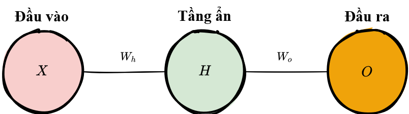
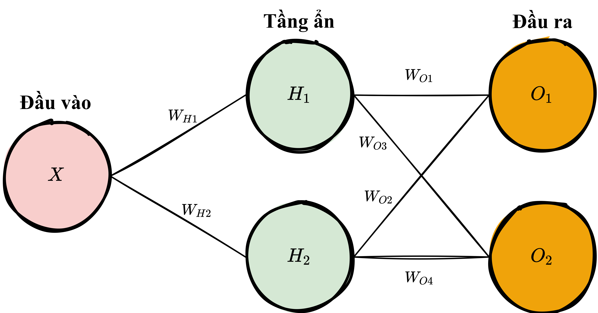

.. _forwardpropagation:

======================================
Lan truyền xuôi - *Forwardpropagation*
======================================

.. contents:: :local:

Mạng nơ-ron đơn giản
====================

Lan truyền xuôi trong mạng nơ-ron là quá trình mà mạng nơ-ron đưa ra dự đoán.
Dữ liệu đầu vào được "truyền xuôi" qua từng tầng của mạng tới tầng cuối cùng, cũng là tầng đầu ra chứa dự đoán của mạng.

Với một mạng nơ-ron đơn giản chỉ có 1 tầng ẩn như hình minh hoạ trên với mỗi tầng chỉ có 1 nơ-ron, quá trình lan truyền xuôi có thể được mô tả bằng công thức toán học như sau:

.. math::

  \text{Dự đoán} = A(\;A(\;X W_h\;)W_o\;)

trong đó :math:`A` là hàm kích hoạt (ví dụ như :ref:`activation_relu`), :math:`X` là đầu vào của mạng, :math:`W_h` và :math:`W_o` lần lượt là trọng số của từng tầng trong mạng.

Các bước thực hiện lan truyền xuôi
----------------------------------

1. Đánh trọng số đầu vào khi truyền dữ liệu đầu vào tới tầng ẩn bằng cách nhân :math:`X` với trọng số ẩn :math:`W_h`.
2. Áp dụng hàm kích hoạt ở tầng ẩn và truyền kết quả tới tầng đầu ra.
3. Lặp lại bước 2, tuy nhiên lần này với :math:`X` là kết quả :math:`H` mà tầng ẩn trả về. Ta thu được kết quả dự đoán :math:`O`.

Code
----

Hãy cùng viết phương thức :code:`feed_forward()` để truyền dữ liệu đầu vào qua mạng đơn giản trên.
Đầu ra của phương thức này chính là kết quả dự đoán của mô hình.

.. literalinclude:: ../code/nn_simple.py
    :language: python
    :lines: 4-16

Trong đoạn code trên, ``x`` là đầu vào của mạng, ``Zo`` và ``Zh`` là kết quả đánh trọng số đầu vào, và ``Wo`` và ``Wh`` là các trọng số.

Truyền xuôi trong Mạng Nơ-ron thực tế
=====================================

Trường hợp mạng nơ-ron đơn giản trên khá hữu ích để làm quen với khải niệm lan truyền xuôi, nhưng trong thực tế thì các mạng nơ-ron thường phức tạp hơn nhiều.
Các mạng nơ-ron hiện đại có nhiều tầng ẩn hơn, mỗi tầng có rất nhiều nơ-ron, đầu vào cũng gồm có nhiều thuộc tính hơn, và đầu ra thì có nhiều biến mà mô hình phải dự đoán.
Để huấn luyện các mạng nơ-ron trong thực tế, phần này sẽ giới thiệu các phép toán trên ma trận mà có thể được sử dụng để huấn luyện bất kỳ mạng nơ-ron nào.

Kiến trúc
---------

Để phù hợp với các kích thước dữ liệu đầu ra và đầu vào lớn hơn, ta cần mở rộng đoạn code mạng nơ-ron trên bằng cách thêm vào vài tham số cho phương thức khởi tạo của mạng (:code:`__init__`): ``inputLayerSize``, ``hiddenLayerSize``, ``outputLayerSize``.
Ta vẫn sẽ giới hạn mạng chỉ có 1 tầng ẩn (tham khảo :ref:`Định lý xấp xỉ phổ quát <glossary_uat>`), nhưng ta có thể xây dựng mạng với các kích thước khác nhau tuỳ vào dữ liệu đầu vào và đầu ra.

.. literalinclude:: ../code/nn_matrix.py
    :language: python
    :lines: 6-8

Khởi tạo trọng số - *Weight Initialization*
-------------------------------------------

Khác với phương thức :code:`feed_forward()` đơn giản ở phần trên với ``Wh`` và ``Wo`` là các số vô hướng, các trọng số cần phải là các mảng numpy.
Mỗi mảng sẽ chứa toàn bộ trọng số của tầng đó - mỗi trọng số tương ứng với 1 khớp thần kinh (*synapse*).

.. literalinclude:: ../code/nn_matrix.py
    :language: python
    :pyobject: init_weights

Trong đoạn code trên, ta khởi tạo mỗi mảng trọng số bằng phương thức ``np.random.randn(rows, cols)`` của numpy.
Phương thức này trả về một ma trận với các giá trị ngẫu nhiên được chọn ngẫu nhiên từ một phân phối chuẩn với kỳ vọng bằng :math:`0` và độ lệch chuẩn :math:`1`.
Một số ví dụ sử dụng hàm ``random.randn()``:

::

  arr = np.random.randn(1, 2)

  print(arr)
  >> [[-0.36094661 -1.30447338]]

  print(arr.shape)
  >> (1,2)

Như bạn có thể thấy, số chiều của các ma trận trọng số phải tuân theo các quy luật nhất định.
Số chiều của ma trận trọng số giữa 2 tầng được quyết đỉnh bởi kích thước của 2 tầng đó, trong đó số *hàng (rows)* phải bằng với số nơ-ron của tầng trước, và số *cột (columns)* phải bằng với số nơ-ron của tầng sau đó.
Điều này có nghĩa là có 1 trọng số tương ứng với 1 khớp thần kinh liên kết giữa 2 nơ-ron giữa 2 tầng.

Bạn đọc có thể tham khảo thêm về khởi tạo trọng số ngẫu nhiên trong ghi chú khoá học CS231 của Stanford [1]_, chương Neural Network - Mạng nơ-ron.

Hệ số điều chỉnh
---------------

:ref:`nn_bias` là một hệ số phụ gắn với từng nơ-ron và được biểu diễn bằng các vector.
Sử dụng phương thức ``np.full()`` của numpy, ta có thể tạo một mảng hệ số điều chỉnh 1 chiều (1 vector) với giá trị mặc định là ``0.2``.
Tham số đầu tiên của ``np.full()`` là số chiều của mảng cần tạo, và tham số thứ 2 là giá trị mặc định của mỗi phần tử trong mảng.

.. literalinclude:: ../code/nn_matrix.py
    :language: python
    :pyobject: init_bias

Các thao tác với ma trận
------------------------

Để tận dụng các kỹ thuật tính toán nhanh của đại số tuyến tính cũng như sức mạnh của GPU, ta cần lưu trữ dữ liệu, trọng số, và hệ số điều chỉnh trong các ma trận.
Sơ đồ dưới đây biểu diễn một mạng nơ-ron 1 tầng ẩn với các phép toán trên ma trận cho quá trình lan truyền xuôi.

.. image:: images/nn_with_matrices_displayed.png
    :align: center

Số chiều của các ma trận liên kết với nhau một cách tự nhiên theo kiến trúc của mạng và số lượng mẫu dữ liệu trong tập huấn luyện.
Để hiểu kỹ hơn sơ đồ trên, hãy cùng phân tích chi tiết từng ma trận và tại sao các ma trận lại có số chiều như vậy.

.. rubric:: Số chiều các ma trận

+-------------+------------------------------------------------+--------------+-----------------------------------------------------------------------------------------------------------------------------------------------------------------------------+
| **Tham số** | **Tên gọi**                                    | **Số chiều** | **Giải thích**                                                                                                                                                              |
+=============+================================================+==============+=============================================================================================================================================================================+
|    ``X``    | Dữ liệu đầu vào                                |    (3, 1)    | Tập huấn luyện có 3 :ref:`quan sát <glossary_observation>`, hay 3 :ref:`mẫu dữ liệu <glossary_instance>`, mỗi quan sát có 1 :ref:`thuộc tính <glossary_attribute>`.         |
+-------------+------------------------------------------------+--------------+-----------------------------------------------------------------------------------------------------------------------------------------------------------------------------+
|    ``Wh``   | Trọng số ẩn                                    |    (1, 2)    | Số hàng bằng với số thuộc tính của dữ liệu trong tập huấn luyện. Số cột bằng với số nơ-ron của tầng ẩn.                                                                     |
+-------------+------------------------------------------------+--------------+-----------------------------------------------------------------------------------------------------------------------------------------------------------------------------+
|    ``Bh``   | Hệ số điều chỉnh ẩn                            |    (1, 2)    | Mỗi nơ-ron trong tầng ẩn có một hệ số điều chỉnh riêng. Ma trận hệ số điều chỉnh được cộng vào ma trận đầu vào sau khi được đánh trọng số, trước khi áp dụng hàm kích hoạt. |
+-------------+------------------------------------------------+--------------+-----------------------------------------------------------------------------------------------------------------------------------------------------------------------------+
|    ``Zh``   | Đầu vào được đánh trọng số ẩn                  |    (3, 2)    | Là tích ma trận :math:`X` và :math:`Wh` và có kích thước tuân theo điều kiện của phép nhân ma trận. Ma trận hệ số điều chỉnh ẩn sau đó cũng được cộng với :math:`Zh`.       |
+-------------+------------------------------------------------+--------------+-----------------------------------------------------------------------------------------------------------------------------------------------------------------------------+
|    ``H``    | Đầu ra kích hoạt ẩn                            |    (3, 2)    | Là kết quả của việc áp dụng hàm kích hoạt lên từng phẩn tử của ma trận :math:`Zh`. Mỗi phần tử của ma trận này lưu kết quả kích hoạt của 1 nơ-ron.                          |
+-------------+------------------------------------------------+--------------+-----------------------------------------------------------------------------------------------------------------------------------------------------------------------------+
|    ``Wo``   | Trọng số đầu ra                                |    (2, 2)    | Số hàng bằng với số nơ-ron của tầng ẩn, và số cột bằng số nơ-ron của tầng đầu ra.                                                                                           |
+-------------+------------------------------------------------+--------------+-----------------------------------------------------------------------------------------------------------------------------------------------------------------------------+
|    ``Bo``   | Hệ số điều chỉnh đầu ra                        |    (1, 2)    | Có một hệ số điều chỉnh cho mỗi nơ-ron của tầng đầu ra.                                                                                                                     |
+-------------+------------------------------------------------+--------------+-----------------------------------------------------------------------------------------------------------------------------------------------------------------------------+
|    ``Zo``   | Kết quả kích hoạt ẩn được đánh trọng số đầu ra |    (3, 2)    | Là tích ma trận :math:`H` và :math:`Wo` và cộng với ma trận hệ số điều chỉnh đầu ra :math:`Bo`.                                                                             |
+-------------+------------------------------------------------+--------------+-----------------------------------------------------------------------------------------------------------------------------------------------------------------------------+
|    ``O``    | Kích hoạt đầu ra                               |    (3, 2)    | Mỗi hàng của ma trận đầu ra là dự đoán của một quan sát trong tập huấn luyện, và mỗi cột là 1 thuộc tính mà ta cần dự đoán.                                                 |
+-------------+------------------------------------------------+--------------+-----------------------------------------------------------------------------------------------------------------------------------------------------------------------------+

Kích thước động
---------------

Trước khi tiếp tục, ta sẽ xét trường hợp khi kích thước tập huấn luyện thay đổi thì các chiều của ma trận sẽ thay đổi cùng với kiến trúc mạng như thế nào.
Ví dụ, với một mạng có 2 nơ-ron đầu vào, 3 nơ-ron ẩn, 2 nơ-ron đầu ra, và 4 quan sát trong tập huấn luyện.

.. image:: images/dynamic_resizing_neural_network_4_obs.png
    :align: center

Bây giờ hãy huấn luyện mạng với chỉ 1 quan sát trong tập dữ liệu:

.. image:: images/dynamic_resizing_neural_network_1_obs.png
    :align: center

Như bạn có thể thấy, số cột trong tất cả các ma trận đều giữ nguyên.
Sự thay đổi duy nhất là số hàng của các ma trận kết quả của từng tầng do chúng phụ thuộc vào kích thước của tập huấn luyện.
Số chiều của các ma trận trọng số cũng được giữ nguyên.
Điều này có nghĩa là ta có thể sử dụng cùng 1 mạng, với cùng 1 đoạn code, để học với các số lượng quan sát khác nhau.

Cải tiến đoạn code - *Refactoring*
----------------------------------

Dưới đây là đoạn code lan truyền xuôi mới với các phép toán trên ma trận thay vì số vô hướng.

.. literalinclude:: ../code/nn_matrix.py
    :language: python
    :pyobject: feed_forward

.. rubric:: Đánh trọng số đầu vào

Đầu tiên, ta cần cập nhật dòng code đánh trọng số đầu vào thành phép toán xử lý trên ma trận.
Ta sử dụng phương thức tích vô hướng để nhân ma trận đầu vào với trọng số để truyển dữ liệu tới tầng tiếp theo.
Sau đó ta cộng với vector hệ số điều chỉnh sử dụng phép cộng ma trận.

::

  Zh = np.dot(X, Wh) + Bh

.. image:: images/neural_network_matrix_weighted_input.png
    :align: center

Cột đầu tiên của ``Bh`` được cộng vào phần tử đầu tiên của tất cả các hàng của tích giữa ``X`` và ``Wh``, và tương tự cột thứ 2 của ``Bh`` được cộng vào phân tử thứ 2 của tất cả các hàng.
Kết quả của dòng code này là ma trận ``Zh`` với từng cột tương ứng với từng nơ-ron của tầng ẩn, và từng hàng tương ứng với từng quan sát trong tập dữ liệu.
Do ta giả sử tất cả các tầng trong mạng đều là các *liên kết đầy đủ*, sẽ luôn có 1 trọng số tương ứng với 1 liên kết giữa nơ-ron với nơ-ron giữa các tầng.

Quá trình này diễn ra tương tự đối với tầng đầu ra, trừ việc lúc này, đầu vào của phép nhân ma trận sẽ là ma trận kích hoạt ẩn ``H``và trọng số ``Wo``.

.. rubric:: Kích hoạt ReLU

Tiếp theo, ta cần cải tiến hàm ReLU để tương thích với thao tác trên từng phần tử của ma trận.
Đây là một thay đổi nhỏ nhưng rất cần thiết nếu ta muốn tính toán với ma trận.
Phương thức ``np.maxinum()`` thực chất là một hàm có thể thao tác linh hoạt trên cả số vô hướng lẫn mảng.

.. literalinclude:: ../code/nn_matrix.py
    :language: python
    :pyobject: relu

Trong bước kích hoạt cho tầng ẩn, ta áp dụng hàm kích hoạt ReLO ``np.maximum(0,Z)`` lên tất cả các phần tử của ma trận.
Kết quả là tất cả các giá trị âm trong ma trận sẽ được thay thế bằng giá trị :math:`0`.
Bước này được lặp lại tương tự đổi với tầng đầu ra, trừ việc ta sẽ áp dụng ReLU lên ``Zo``.

Kết luận
--------

Tổng kết lại, ta có đoạn code sau mô tả quá trình lan truyền xuôi trong mạng nơ-ron với ma trận.

.. literalinclude:: ../code/nn_matrix.py
    :language: python
    :lines: 6-60

.. rubric:: Tài liệu tham hảo

.. [1] http://cs231n.github.io/neural-networks-2/#init
