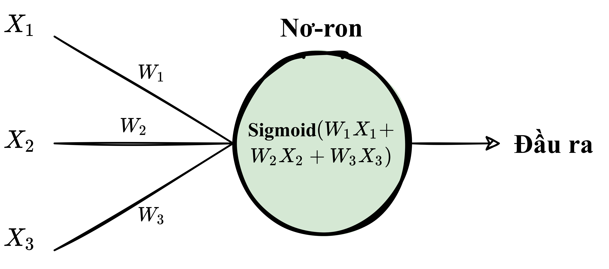

.. _nn_concepts:

====================
Các khái niệm cơ bản
====================

.. contents:: :local:

Mạng Nơ-ron - *Neural Network*
==============================

Mạng nơ-ron, hay còn được gọi là mạng thần kinh nhân tạo, là một họ các thuật toán học máy được sử dụng để mô hình hoá các mối quan hệ phức tạp trong dữ liệu sử dụng nhiều tầng ẩn và các hàm kích hoạt phi tuyến.
Một mạng nơ-ron truyền đầu vào qua nhiều tầng nơ-ron ẩn qua các kết nối (mỗi tầng là một hàm con với hệ số riêng biệt cần phải học), và trả về đầu ra là kết quả dự đoán là sự kết hợp của tất cả các nơ-ron trong mạng.

.. image:: images/neural_network_w_matrices.png
    :align: center
    :height: 464 px
    :width: 884 px
    :scale: 55 %

Một mạng nơ-ron có thể được huấn luyện bằng các kỹ thuật tối ưu như :doc:`gradient_descent_vn`.
Sau mỗi vòng lặp, hàm lỗi tượng trưng cho mất mát dự đoán được tính dựa vào sự sai lệch giữa dự đoán của mô hình và quan sát thực tế.
Đạo hàm của hàm lỗi được tính và truyền ngược lại mạng sử dụng kỹ thuật có tên gọi :doc:`backpropagation_vn`.
Các hệ số (trọng số) của mỗi nơ-ron sau đó được điều chỉnh tuỳ vào ảnh hưởng của nó tới tổng lỗi của mạng (dựa vào đạo hàm riêng).
Quá trình học này được lặp đi lặp lại cho tới khi hàm lỗi đạt giá trị dưới 1 ngưỡng nhất định.

Nơ-ron
======

Một nơ-ron nhận 1 vector đầu vào được đánh trọng số, đưa đầu vào qua hàm kích hoạt, và trả về đầu ra.

    Một nơ-ron với các đầu vào :math:`(X_1, X_2, X_3)`, các trọng số :math:`(W_1, W_2, W_3)` trên khớp thần kinh, và hàm kích hoạt **Sigmoid**.

Đầu vào của mỗi nơ-ron có thể là vector đặc trưng từ tập huấn luyện, hoặc là đầu ra của tầng nơ-ron trước nó.
Từng phần tử của đầu vào sau đó được đánh trọng số khi được truyền qua khớp thần kinh (*synapse*) tới nơ-ron.
Nơ-ron sau đó áp dụng hàm kích hoạt lên "tổng đầu vào đã được đánh trọng số" từ mỗi khớp thần kinh tới và truyền kết quả ở đầu ra tới tất cả các nơ-ron ở tầng tiếp theo.

Khớp thần kinh - *Synapse*
==========================

Các khớp thần kinh cũng giống như các đường truyền trong mạng nơ-ron.
Chúng liên kết đầu vào với các nơ-ron, nơ-ron ở tầng trước tới nơ-ron tầng kế tiếp, và từ nơ-ron tới đầu ra.
Để có thể đi từ 1 nơ-ron này tới 1 nơ-ron khác, thông tin sẽ phải di chuyển qua các khớp thần kinh và trả lệ phí (đánh trọng số) khi đi qua.

Thông thường, giữa 2 nơ-ron chỉ có 1 khớp thần kinh duy nhất liên kết chúng với nhau và được gán cho 1 trọng số riêng biệt.
Khi ta đề cập tới việc cập nhật trọng số trong một mạng, thực chất đó là việc điều chỉnh các trọng số của các khớp thần kinh này.

.. _nn_weights:

Trọng số
========

Trọng số là các giá trị quy định cường độ liên kết giữa 2 nơ-ron.
Tức là thông tin khi được truyền giữa các nơ-ron sẽ được nhân với trọng số (thường thì sẽ cộng thêm 1 giá trị nữa gọi là hệ số điều chỉnh), và qua đó quy định sự ảnh hưởng của thông tin đó tới đầu ra.

.. _nn_bias:

Hệ số điều chỉnh - *Bias*
=========================

Hệ số điều chỉnh là một hệ số phụ gắn với các nơ-ron, được cộng vào trọng số sau khi đã đánh trọng số và trước khi đưa qua hàm kích hoạt.
Hệ số điều chỉnh giúp mô hình biểu diễn mối quan hệ tuyến tính mà không đi qua gốc toạ độ (như đã đề cập :ref:`tại đây <glossary_bias_term>`).
Hệ số điều chỉnh cũng cần được học trong quá trình huấn luyện mạng nơ-ron.

Các tầng trong mạng nơ-ron cơ bản - *Layers*
============================================

.. image:: images/neural_network_simple.png
    :align: center
    :height: 224 px
    :width: 804 px
    :scale: 60 %

.. rubric:: Tầng đầu vào

Là tầng mà dữ liệu đầu vào sẽ được truyền vào mô hình.
Mỗi nơ-ron trong tầng đầu vào biểu diễn 1 thuộc tính của tập dữ liệu (ví dụ như chiều cao, màu tóc, ..v.v..).

.. rubric:: Tầng ẩn - Hidden Layer

Là các tầng ở giữa tầng đầu vào và đầu ra và áp dụng hàm kích hoạt trước khi truyền kết quả ra.
Thường thì các mạng nơ-ron sẽ có nhiều tầng ẩn.
Trong các mạng truyền thống, các tầng ẩn thường là các tầng kết nối đầy đủ (*fully-connected*) - mỗi nơ-ron nhận đầu ra từ tất cả các nơ-ron của tầng trước làm đầu vào và đưa kết quả của nó tới tất cả các nơ-ron ở tầng kế tiếp.
Đặc điểm này trái ngược với các tầng tích chập (*convolutional*) khi các nơ-ron chỉ truyền kết quả đầu ra của nó tới 1 vài nơ-ron ở tầng kế tiếp.

.. rubric:: Tầng đầu ra

Là tầng cuối cùng của mạng nơ-ron.
Nó nhận đầu ra của các nơ-ron từ tầng trước, áp dụng hàm kích hoạt (không bắt buộc), và trả về kết quả đại diện cho dự đoán của mô hình.

Đánh trọng số
=============

Đầu vào của 1 nơ-ron bằng tổng đầu ra của các nơ-ron của tầng trước đã được đánh trọng số.
Điều này nghĩa là mỗi phần tử của đầu vào được nhân với 1 trọng số tương ứng với khớp thần kinh mà liên kết tới nơ-ron này.
Nếu có 3 nơ-ron ở tầng trước trong 1 mạng liên kết đầy đủ chẳng hạn, mỗi nơ-ron của tầng trước sẽ có 3 trọng số riêng biệt - mỗi trọng số tương ứng với 1 khớp thần kinh.

**Đầu vào đơn**

.. math::

  Z &= Input \cdot Weight \\
    &= X W

**Nhiều đầu vào**

.. math::

  Z &= \sum_{i=1}^{n}x_i w_i \\
    &= x_1 w_1 + x_2 w_2 + x_3 w_3 + \ldots

*Chú ý* rằng công thức trên giống hệt với công thức của mô hình hồi quy tuyến tính.
Thực chất, mạng nơ-ron với 1 nơ-ron chính là mô hình hồi quy tuyến tính.
Sự khác biệt duy nhất là giai đoạn áp dụng hàm kích hoạt tại mỗi nơ-ron sau khi tính tổng đầu vào đánh trọng số.

Hàm kích hoạt - Activation Functions
====================================

:ref:`Hàm kích hoạt <activation_functions_vn>` tồn tại trong các tầng của mạng nơ-ron và biến đổi dữ liệu nơ-ron nhận được trước khi truyền thông tin sang tầng kế tiếp.
Hàm kích hoạt chính là thành phần cho phép mạng nơ-ron mô hình hoá các quan hệ phi tuyến phức tạp giữa các thuộc tính trong dữ liệu.
Một số hàm kích hoạt được sử dụng phổ biến trong các mạng nơ-ron gồm có :ref:`hàm relu <activation_relu>` và :ref:`hàm sigmoid <activation_sigmoid>`.

Các hàm kích hoạt thường có các tính chất sau:

  * **Phi tuyến** - Trong hồi quy tuyến tính, ta bị giới hạn bởi phương trình dự đoán có đồ thị dạng một đường thẳng. Phương trình tuyến tính này phù hợp với các tập dữ liệu đơn giản với quan hệ một-một giữa đầu vào và đầu ra, nhưng sẽ thế nào nếu hình mẫu quan hệ trong tập dữ liệu là các hàm phi tuyến (như :math:`x^2`, :math:`\sin`, hay :math:`\log`)? Để mô hình hoá các quan hệ này ta cần các phương trình dự đoán có dạng phi tuyến. Các hàm kích hoạt giúp mạng nơ-ron đạt được điều kiện này.

  * **Khả vi và liên tục** - Để cải thiện mô hình với hạ gradient, ta cần hàm dự đoán đầu ra phải có dạng đẹp đủ để ta tính đạo hàm lỗi theo các trọng số. Nếu một nơ-ron chỉ dự đoán :math:`0` hoặc :math:`1` (perceptron), tức là hàm dự đoán rời rạc không khả vi, ta sẽ không biết nên phải cập nhật trọng số theo hướng nào.

  * **Khoảng giá trị cố định** - Một hàm kích hoạt thường ép dữ liệu đầu vào về 1 khoảng giá trị nhất định để giúp cho quá trình huấn luyện ổn định và hiệu quả hơn.

Hàm mất mát - *Loss Function*
=============================

Một hàm mất mát, hay hàm chi phí, giúp ta đánh giá khả năng dự đoán của mô hình với tập tham số hiện tại.
Hàm mất mát có đồ thị và đạo hàm của riêng nó.
Độ dốc của đồ thị cho ta biết ta nên cập nhật tham số thế nào để giúp mô hình dự đoán chính xác hơn.

Hàm mất mát hay hàm chi phí có thể tồn tại dưới nhiều dạng khác nhau tuỳ vào bài toán cần giải quyết.
Một số hàm mất mát được sử dụng phổ biến gồm có :ref:`mse` and :ref:`Mất mát entropy chéo <loss_cross_entropy>`.

Thuật toán tối ưu - *Optimization Algorithms*
=============================================

Be the first to `contribute! <https://github.com/bfortuner/ml-cheatsheet>`__

Chồng chất gradient - *Gradient Accumulation*
=============================================

Chồng chất gradient là một cơ chế chia nhỏ 1 batch dữ liệu trong huấn luyện mạng nơ-ron thành nhiều batch nhỏ hơn để tính toán.
Từ "chồng chất (*accumulation*)" trong tên gọi chồng chất gradient có nghĩa là chạy các batch nhỏ nối tiếp nhau (thường thì trên cùng 1 GPU) trong khi cộng dồn gradient của mỗi batch nhỏ lại và không cập nhật các tham số mô hình - các trọng số và hệ số điều chỉnh.
Các tham số mô hình không được cập nhật trong quá trình chồng chất để đảm bảo rằng tất cả các batch nhỏ sử dụng cùng 1 bộ tham số để tính toán gradient.
Chỉ sau khi hoàn thành việc tính tổng gradient của tất cả các batch nhỏ của 1 batch thì phương pháp này mới tiến hành sử dụng gradient tổng để cập nhật các tham số mô hình.
Kết quả của quá trình chồng chất gradient giống hệt với khi ta sử dụng cả 1 batch lớn.

Thông thường, kích thước batch lớn sẽ giúp quá trình huấn luyện mô hình được ổn định hơn, nhưng lại yêu cầu bộ nhớ GPU cao.
Do đó, cách làm trên giúp lập trình viên có thể sử dụng kích thước batch lớn mà vẫn đảm bảo được hiệu quả huấn luyện nhờ chia 1 batch thành các batch nhỏ mà thoả mãn yêu cầu về bộ nhớ GPU.

.. image:: images/gradient_accumulation.png
    :align: center

Để tìm hiểu chi tiết hơn về cơ chế này, bạn đọc có thể tham khảo tại [1]_ với chi tiết thuật toán, cách lập trình và ví dụ ứng dụng chồng chất gradient trong huấn luyện mạng nơ-ron.

.. rubric:: Tài liệu tham khảo

.. [1] https://github.com/run-ai/runai/tree/master/runai/ga/
